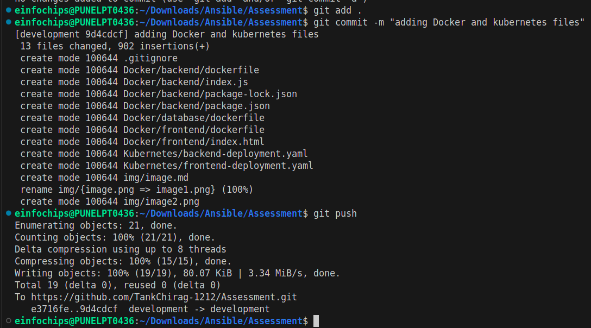
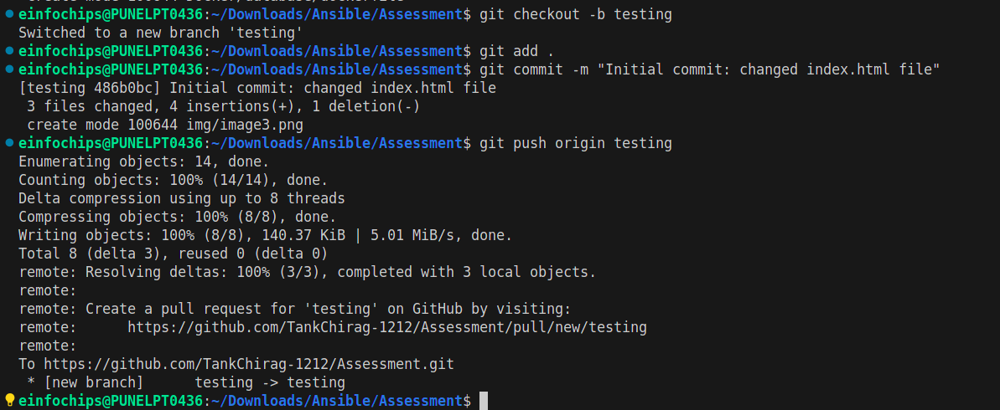
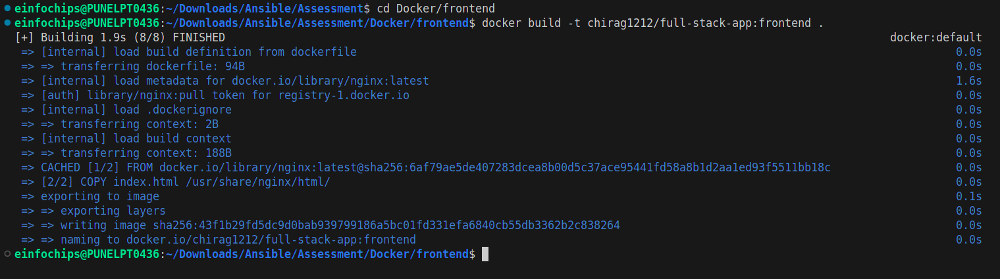
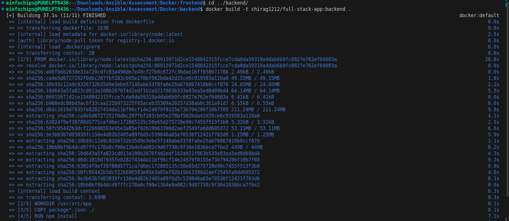
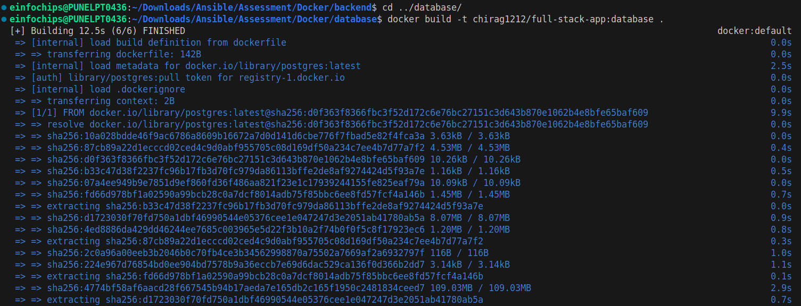
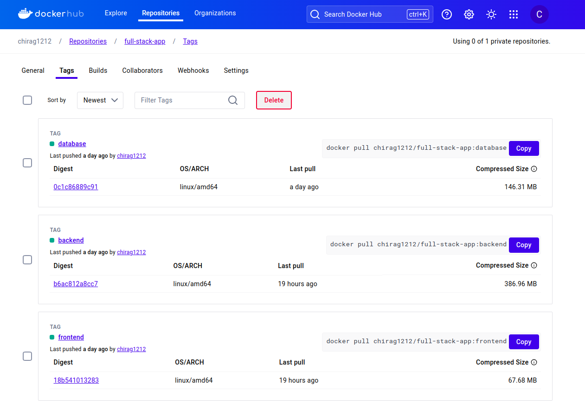
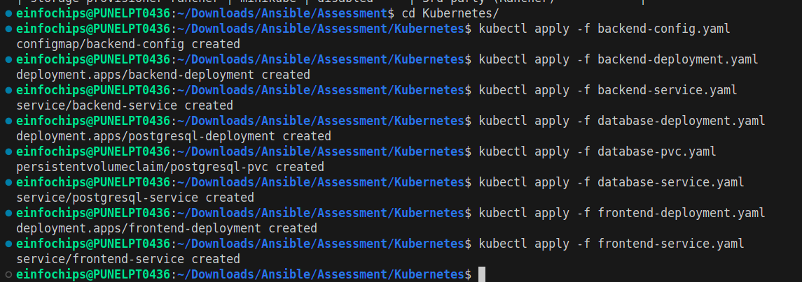
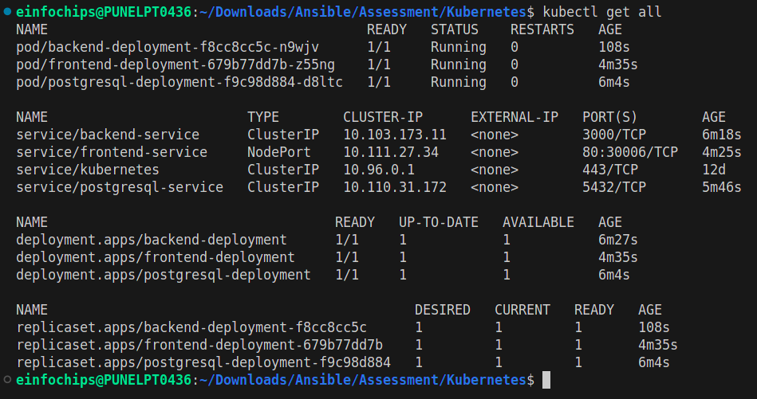
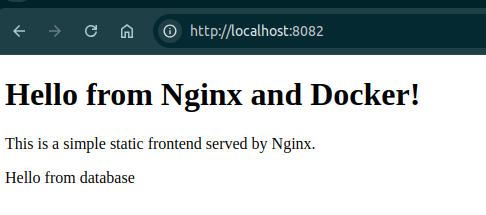

Assessment: Use Case Oriented Project
=======

### Project Overview

You are tasked with setting up a CI/CD pipeline for a microservices-based application. The application will be containerized using Docker and orchestrated using Kubernetes. Ansible will be used for configuration management and deployment. The entire setup should be managed using Git for version control, and Jenkins will be used to automate the CI/CD process.

### Assessment Criteria
1. **Git:**
    - Repository setup
    - Branching strategies
    - Commit and merge practices
2. **Jenkins:**
    - Pipeline creation using Jenkinsfile
    - Integration with Git
    - Automated build, test, and deployment stages
3. **Docker:**
    - Dockerfile creation
    - Image building and management
    - Containerization of microservices
4. **Kubernetes:**
    - Pod and service creation
    - Deployments and replica sets
    - ConfigMaps and Secrets
5. **Ansible:**
    - Playbook creation
    - Use of variables and templates
    - Inventory management

### Use Case Scenario
Your company is developing a new e-commerce application consisting of several microservices: a front-end service, a product catalog service, and an order processing service. The goal is to automate the deployment and configuration of these services across  development, testing, and production environments using Ansible, Docker, Kubernetes, and Jenkins.

### Tasks and Deliverables

#### Task 1: Git Repository Setup

1. **Create a Git repository** to store all project files, including Ansible playbooks,Dockerfiles, and Kubernetes manifests.


2. **Branching Strategy:**
    - Create branches for development, testing, and production.

    

    

    

    - Implement a strategy for merging changes from development to testing and production.

    

----------

#### Task 2: Dockerize Microservices
1. **Create Dockerfiles** for each microservice (front-end, product catalog, order processing).
> Dockerfile for frontend

```dockerfile
FROM nginx:latest
COPY index.html /usr/share/nginx/html/
```

> Dockerfile for order processing

```dockerfile
FROM node:latest

WORKDIR /usr/src/app

COPY package*.json ./
RUN npm install

COPY . .

EXPOSE 3000
CMD ["node", "index.js"]
```

> Dockerfile for product catalog
```dockerfile
FROM postgres:latest
ENV POSTGRES_USER=<postgres_username>
ENV POSTGRES_PASSWORD=<postgres_pass>
ENV POSTGRES_DB=mydatabase
```
2. **Build Docker images** for each microservice and push them to a container registry (e.g., Docker Hub).







3. **Deliverables:**
    - Dockerfiles for each microservice
    - Built Docker images in a container registry

    

-------

#### Task 3: Kubernetes Deployment
1. **Create Kubernetes manifests** for deploying each microservice.
    - Define Pods, Services, Deployments, and ReplicaSets.
    - Use ConfigMaps and Secrets for configuration management.

> Kubernetes/frontend-deployment.yaml

```yaml
apiVersion: apps/v1
kind: Deployment
metadata:
  name: frontend-deployment
spec:
  replicas: 1
  selector:
    matchLabels:
      app: frontend
  template:
    metadata:
      labels:
        app: frontend
    spec:
      containers:
      - name: frontend
        image: chirag1212/full-stack-app:frontend_v3
        ports:
        - containerPort: 80
```
> Kubernetes/frontend-service.yaml

```yaml
apiVersion: v1
kind: Service
metadata:
  name: frontend-service
spec:
  selector:
    app: frontend
  ports:
    - protocol: TCP
      port: 80
      targetPort: 80
      nodePort: 30006
  type: NodePort
```
> Kubernetes/backend-config.yaml

```yaml
apiVersion: v1
kind: ConfigMap
metadata:
  name: backend-config
data:
  DATABASE_HOST: postgresql-service
  DATABASE_PORT: "5432"
  DATABASE_USER: <user_name>
  DATABASE_PASSWORD: <database_pass>
  DATABASE_NAME: mydatabase
```

> Kubernetes/backend-deployment.yaml

```yaml
apiVersion: apps/v1
kind: Deployment
metadata:
  name: backend-deployment
spec:
  replicas: 1
  selector:
    matchLabels:
      app: backend
  template:
    metadata:
      labels:
        app: backend
    spec:
      containers:
      - name: backend
        image: chirag1212/full-stack-app:backend
        ports:
        - containerPort: 3000
        env:
        - name: DATABASE_HOST
          valueFrom:
            configMapKeyRef:
              name: backend-config
              key: DATABASE_HOST
        - name: DATABASE_PORT
          valueFrom:
            configMapKeyRef:
              name: backend-config
              key: DATABASE_PORT
        - name: DATABASE_USER
          valueFrom:
            configMapKeyRef:
              name: backend-config
              key: DATABASE_USER
        - name: DATABASE_PASSWORD
          valueFrom:
            configMapKeyRef:
              name: backend-config
              key: DATABASE_PASSWORD
        - name: DATABASE_NAME
          valueFrom:
            configMapKeyRef:
              name: backend-config
              key: DATABASE_NAME
```

> Kubernetes/backend-service.yaml
```yaml
apiVersion: v1
kind: Service
metadata:
  name: backend-service
spec:
  selector:
    app: backend
  ports:
    - protocol: TCP
      port: 3000
      targetPort: 3000
  type: ClusterIP
```

> Kubernetes/database-deployment.yaml

```yaml
apiVersion: apps/v1
kind: Deployment
metadata:
  name: postgresql-deployment
spec:
  replicas: 1
  selector:
    matchLabels:
      app: postgresql
  template:
    metadata:
      labels:
        app: postgresql
    spec:
      containers:
      - name: postgresql
        image: chirag1212/full-stack-app:database
        ports:
        - containerPort: 5432
        env:
        - name: POSTGRES_USER
          value: <user_name>
        - name: POSTGRES_PASSWORD
          value: <Postgres_pass>
        - name: POSTGRES_DB
          value: "mydatabase"
        volumeMounts:
        - name: postgredb-storage
          mountPath: /var/lib/postgresql/data
      volumes:
      - name: postgredb-storage
        persistentVolumeClaim:
          claimName: postgresql-pvc
```

> Kubernetes/database-service.yaml
```yaml
apiVersion: v1
kind: Service
metadata:
  name: backend-service
spec:
  selector:
    app: backend
  ports:
    - protocol: TCP
      port: 3000
      targetPort: 3000
  type: ClusterIP
```

> Kubernetes/database-pvc.yaml
```yaml
apiVersion: v1
kind: PersistentVolumeClaim
metadata:
  name: postgresql-pvc
spec:
  accessModes:
    - ReadWriteOnce
  resources:
    requests:
      storage: 1Gi
```
2. **Deploy the microservice**s to a Kubernetes cluster.



3. **Deliverables:**
    - Kubernetes manifests (YAML files)
    - Successful deployment of microservices in the Kubernetes cluster





------------------------

#### Task 4: Ansible Configuration Management
1. **Create Ansible playbooks** to manage the deployment and configuration of the microservices.
    - Use variables to handle environment-specific configurations.
    - Utilize Jinja2 templates to dynamically generate configuration files.
2. **Set up Ansible inventories** to manage different environments (development, testing, production).
3. **Deliverables:**
    - Ansible playbooks
    - Ansible inventory files
    - Jinja2 templates for configuration files

-------

#### Task 5: Jenkins CI/CD Pipeline
1. **Set up a Jenkins pipeline** using a Jenkinsfile.
    - Integrate with Git to trigger the pipeline on code changes.
    - Define stages for building Docker images, pushing them to the registry, deploying to Kubernetes, and running tests.
2. **Implement error handling** and notifications to alert the team on failures.
3. **Deliverables:**
    - Jenkinsfile defining the CI/CD pipeline
    - Screenshots or logs demonstrating successful pipeline execution

------
### Evaluation Criteria

Participants will be evaluated based on the following:

1. **Git:**
    - Proper repository setup with clear structure and documentation
    - Effective branching strategy and merge practices
2. **Docker:**
    - Correct and efficient Dockerfile creation
    - Successful building and pushing of Docker images
3. **Kubernetes:**
    - Accurate and functional Kubernetes manifests
    - Successful deployment and management of microservices in the cluster
4. **Ansible:**
    - Well-structured playbooks with proper use of variables and templates
    - Effective inventory management for different environments
5. **Jenkins:**
    - Comprehensive and functional Jenkins pipeline
    - Proper integration with Git and handling of build, test, and deployment stages
    - Effective error handling and notifications

### Submission
- Participants should submit the following:
- Git repository URL with all project files
- Docker Hub repository links to the built images
- Screenshots or logs of the Kubernetes deployment
- Jenkins pipeline execution logs or screenshots
- Detailed documentation explaining the setup and configurations