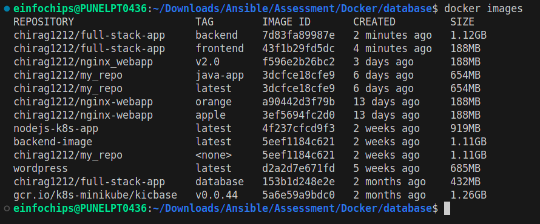
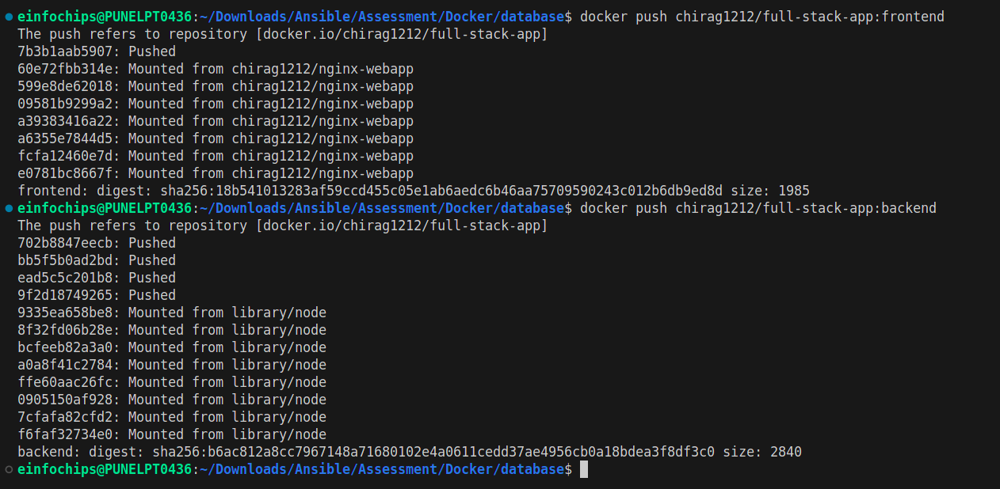
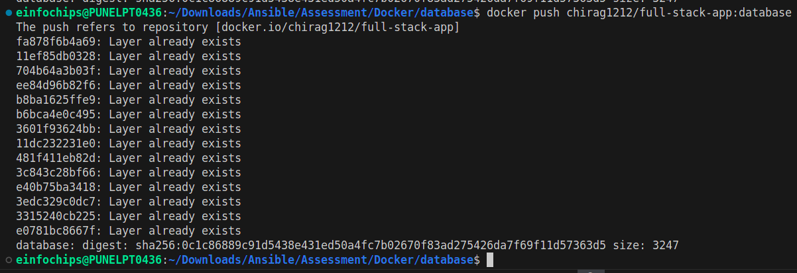
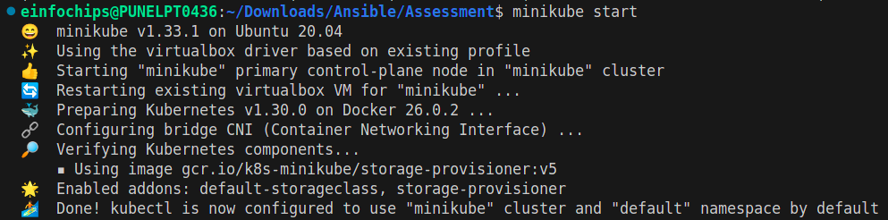
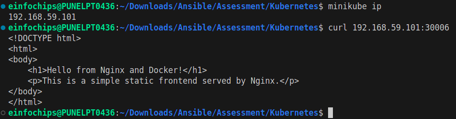

GIT
========


-------------------
DOCKER
=======








----------------
KUBERNETES
===========

- to check that backend is connected or working properly or not 
```
kubectl port-forward service/backend-service 3000:3000
curl http://localhost:3000/data
```






